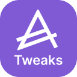
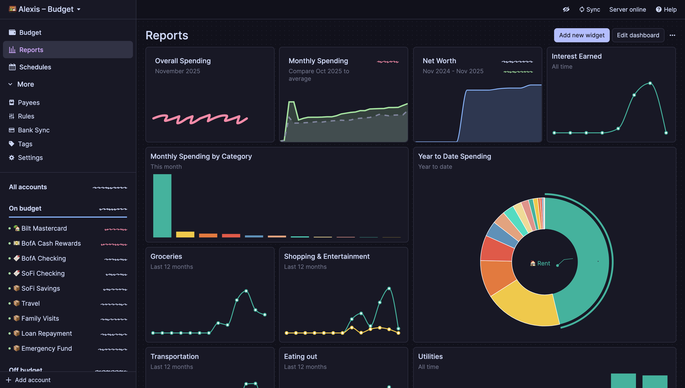

## Recommended IDE Setup

[VS Code](https://code.visualstudio.com/) + [Svelte](https://marketplace.visualstudio.com/items?itemName=svelte.svelte-vscode).

<!-- PROJECT SHIELDS -->

[![Contributors][contributors-shield]][contributors-url]
[![Forks][forks-shield]][forks-url]
[![Stargazers][stars-shield]][stars-url]
[![Issues][issues-shield]][issues-url]
[![MIT License][license-shield]][license-url]

<!-- PROJECT LOGO -->
 

  

  <h3 align="center">Actual Budget Tweaks</h3>

  

     A community-built collection of 30+ tweaks for Actual Budget — themes, layout, readability, and workflow improvements you turn on individually.
     
    <a href="https://abt.alexis.lol"><strong>Website</strong></a>
    ·
    <a href="https://abt.alexis.lol/features">All settings</a>
     
     
    <b>Install from your browser's extension store:</b> 
    <a href="https://github.com/aelxxs/actual-budget-tweaks/releases/latest">Firefox (.xpi)</a> |
    <a href="https://chromewebstore.google.com/detail/actual-budget-%E2%80%93-tweaks/oknpncidmkhkphpbkamccnobdpibegmm">Chrome Web Store</a>
     
     
    <a href="https://github.com/aelxxs/actual-budget-tweaks/issues/new?template=bug_report.yml">Report Bug</a>
    &middot;
    <a href="https://github.com/aelxxs/actual-budget-tweaks/issues/new?template=feature_request.yml">Request Feature</a>
  

<!-- TABLE OF CONTENTS -->

  
Table of Contents

  <ol>
    <li><a href="#about-the-project">About The Project</a></li>
    <li><a href="#installation">Installation</a></li>
    <li><a href="#contributing">Contributing</a></li>
    <li><a href="#license">License</a></li>
  </ol>

<!-- ABOUT THE PROJECT -->

## About The Project

[![Screenshot][product-screenshot]](https://abt.alexis.lol)

Adds user-configurable interface options to Actual Budget — dynamic themes, layout adjustments, readability tweaks, and workflow additions — without altering core app behavior.

Built with [Svelte 5][Svelte-url] on [WXT][WXT-url].

(<a href="#readme-top">back to top</a>)

### Installation

**Install Actual Budget Tweaks from your browser's extension store:**

- **Firefox:** [Download the latest release (.xpi)](https://github.com/aelxxs/actual-budget-tweaks/releases/latest)
- **Chrome:** [Install from Chrome Web Store](https://chromewebstore.google.com/detail/actual-budget-%E2%80%93-tweaks/oknpncidmkhkphpbkamccnobdpibegmm)

<!-- CONTRIBUTING -->

## Contributing

Adding a new tweak usually takes about 5 minutes; see [CONTRIBUTING.md](CONTRIBUTING.md) for local setup, the scaffolding command, and the conventions this codebase expects.

1. Fork the Project
2. Create your Feature Branch (`git checkout -b feature/AmazingFeature`)
3. Commit your Changes (`git commit -m 'feat: add some amazing feature'`)
4. Push to the Branch (`git push origin feature/AmazingFeature`)
5. Open a Pull Request

### Top contributors:

(<a href="#readme-top">back to top</a>)

<!-- LICENSE -->

## License

Distributed under the MIT License. See [`LICENSE`](LICENSE) for the full text.

(<a href="#readme-top">back to top</a>)

<!-- MARKDOWN LINKS & IMAGES -->
<!-- https://www.markdownguide.org/basic-syntax/#reference-style-links -->

[contributors-shield]: https://img.shields.io/github/contributors/aelxxs/actual-budget-tweaks.svg?style=for-the-badge
[contributors-url]: https://github.com/aelxxs/actual-budget-tweaks/graphs/contributors
[forks-shield]: https://img.shields.io/github/forks/aelxxs/actual-budget-tweaks.svg?style=for-the-badge
[forks-url]: https://github.com/aelxxs/actual-budget-tweaks/network/members
[stars-shield]: https://img.shields.io/github/stars/aelxxs/actual-budget-tweaks.svg?style=for-the-badge
[stars-url]: https://github.com/aelxxs/actual-budget-tweaks/stargazers
[issues-shield]: https://img.shields.io/github/issues/aelxxs/actual-budget-tweaks.svg?style=for-the-badge
[issues-url]: https://github.com/aelxxs/actual-budget-tweaks/issues
[license-shield]: https://img.shields.io/github/license/aelxxs/actual-budget-tweaks.svg?style=for-the-badge
[license-url]: https://github.com/aelxxs/actual-budget-tweaks/blob/main/LICENSE
[product-screenshot]: images/screenshot-1.png
[Svelte-url]: https://svelte.dev/
[WXT-url]: https://wxt.dev/
