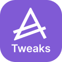
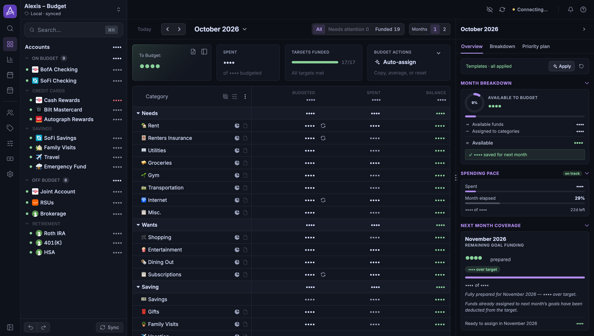
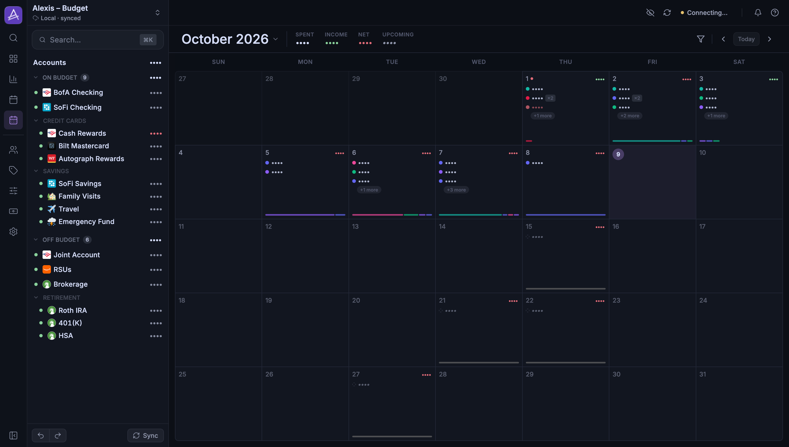

<a id="readme-top"></a>

<!-- PROJECT SHIELDS -->

[![Contributors][contributors-shield]][contributors-url]
[![Forks][forks-shield]][forks-url]
[![Stargazers][stars-shield]][stars-url]
[![Issues][issues-shield]][issues-url]
[![MIT License][license-shield]][license-url]

<!-- PROJECT LOGO -->
<br />
<div align="center">
  <a href="https://github.com/aelxxs/actual-budget-tweaks">
    
  </a>

  <h3 align="center">Actual Budget Tweaks</h3>

  <p align="center">
     A community-built collection of 30+ tweaks for Actual Budget — themes, layout, readability, and workflow improvements you turn on individually.
    <br />
    <a href="https://abt.alexis.lol"><strong>Website</strong></a>
    ·
    <a href="https://abt.alexis.lol/features">All settings</a>
    <br />
    <br />
    <b>Install from your browser's extension store:</b><br />
    <a href="https://github.com/aelxxs/actual-budget-tweaks/releases/latest">Firefox (.xpi)</a> |
    <a href="https://chromewebstore.google.com/detail/actual-budget-%E2%80%93-tweaks/oknpncidmkhkphpbkamccnobdpibegmm">Chrome Web Store</a>
    <br />
    <br />
    <a href="https://github.com/aelxxs/actual-budget-tweaks/issues/new?template=bug_report.yml">Report Bug</a>
    &middot;
    <a href="https://github.com/aelxxs/actual-budget-tweaks/issues/new?template=feature_request.yml">Request Feature</a>
  </p>
</div>

<!-- TABLE OF CONTENTS -->
<details>
  <summary>Table of Contents</summary>
  <ol>
    <li><a href="#about-the-project">About The Project</a></li>
    <li><a href="#installation">Installation</a></li>
    <li><a href="#contributing">Contributing</a></li>
    <li><a href="#license">License</a></li>
  </ol>
</details>

<!-- ABOUT THE PROJECT -->

## About The Project

Adds user-configurable interface options to Actual Budget — dynamic themes, layout adjustments, readability tweaks, and workflow additions — without altering core app behavior.

- **Themes:** browse community themes, or build your own in the palette editor, with separate light and dark picks.
- **Live sidebar:** live balances, account groups, search and pinned shortcuts, as a standard sidebar or an icon bar.
- **Budget Insights:** a side panel with the month's breakdown, spending pace, next month coverage and priority planning.
- **Spending Calendar:** daily spending and upcoming schedules on a month calendar.
- **Modern Reconcile and Sync recap:** reconcile in a side panel, and review and categorize what a bank sync brought in.
- **Privacy styles:** hide amounts as scribbles or dots, at their real length or a fixed one.

[See all features →](https://abt.alexis.lol/#features)

<a href="https://abt.alexis.lol">
<picture>
  <source media="(prefers-color-scheme: light)" srcset="images/budget-light.png">
  
</picture>
</a>

<picture>
  <source media="(prefers-color-scheme: light)" srcset="images/calendar-light.png">
  
</picture>

### Built with AI

Most of the code is written with Claude, and changes are checked in a running instance of Actual with Playwright. The design, the architecture and the rules every feature follows ([AGENTS.md](AGENTS.md)) are mine, and I review and test each change on a test budget, never real financial data. ABT only changes your budget when you click to, and every tweak can be turned off.

<p align="right">(<a href="#readme-top">back to top</a>)</p>

### Installation

**Install Actual Budget Tweaks from your browser's extension store:**

- **Firefox:** [Download the latest release (.xpi)](https://github.com/aelxxs/actual-budget-tweaks/releases/latest)
- **Chrome:** [Install from Chrome Web Store](https://chromewebstore.google.com/detail/actual-budget-%E2%80%93-tweaks/oknpncidmkhkphpbkamccnobdpibegmm)

**Or self-host it as a sidecar,** a small proxy in front of your Actual server that adds Tweaks to every browser that opens it, with no extension needed. Add it next to Actual in your `docker-compose.yml`:

```yaml
services:
  actual:
    image: actualbudget/actual-server:latest
    restart: unless-stopped
    volumes:
      - ./actual-data:/data
  abt:
    image: ghcr.io/aelxxs/abt-sidecar:latest
    restart: unless-stopped
    environment:
      ACTUAL_ORIGIN: http://actual:5006
    ports:
      - "3005:3005"
    depends_on:
      - actual
```

Then run `docker compose up -d` and open `http://your-server:3005`. Use either the extension or the sidecar for a given Actual address, not both. See [Self-hosting](https://abt.alexis.lol/self-hosting/) for reverse proxies, updating and security.

<!-- CONTRIBUTING -->

## Contributing

Adding a new tweak usually takes about 5 minutes; see [CONTRIBUTING.md](CONTRIBUTING.md) for local setup, the scaffolding command, and the conventions this codebase expects.

1. Fork the Project
2. Create your Feature Branch (`git checkout -b feature/AmazingFeature`)
3. Commit your Changes (`git commit -m 'feat: add some amazing feature'`)
4. Push to the Branch (`git push origin feature/AmazingFeature`)
5. Open a Pull Request

### Top contributors:

<a href="https://github.com/aelxxs/actual-budget-tweaks/graphs/contributors">
  
</a>

<p align="right">(<a href="#readme-top">back to top</a>)</p>

<!-- LICENSE -->

## License

Distributed under the MIT License. See [`LICENSE`](LICENSE) for the full text.

<p align="right">(<a href="#readme-top">back to top</a>)</p>

<!-- MARKDOWN LINKS & IMAGES -->
<!-- https://www.markdownguide.org/basic-syntax/#reference-style-links -->

[contributors-shield]: https://img.shields.io/github/contributors/aelxxs/actual-budget-tweaks.svg?style=for-the-badge
[contributors-url]: https://github.com/aelxxs/actual-budget-tweaks/graphs/contributors
[forks-shield]: https://img.shields.io/github/forks/aelxxs/actual-budget-tweaks.svg?style=for-the-badge
[forks-url]: https://github.com/aelxxs/actual-budget-tweaks/network/members
[stars-shield]: https://img.shields.io/github/stars/aelxxs/actual-budget-tweaks.svg?style=for-the-badge
[stars-url]: https://github.com/aelxxs/actual-budget-tweaks/stargazers
[issues-shield]: https://img.shields.io/github/issues/aelxxs/actual-budget-tweaks.svg?style=for-the-badge
[issues-url]: https://github.com/aelxxs/actual-budget-tweaks/issues
[license-shield]: https://img.shields.io/github/license/aelxxs/actual-budget-tweaks.svg?style=for-the-badge
[license-url]: https://github.com/aelxxs/actual-budget-tweaks/blob/main/LICENSE
